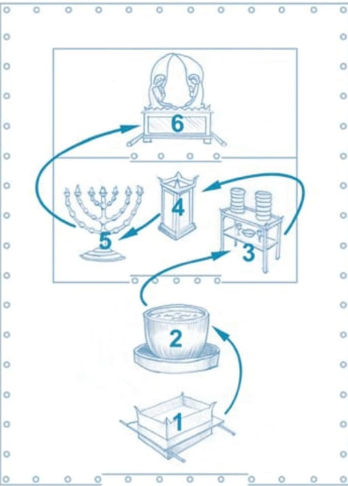

Você já sentiu a pressão do tempo? Principalmente você que é adventista do sétimo dia? 

No livro Mensagens Escolhidas, capítulo 14, volume 2, página 16, é dito: "Milhares na hora undécima verão e reconhecerão a verdade... Essas conversões à verdade operar-se-ão com uma rapidez surpreendente para a igreja, e unicamente o nome de Deus será glorificado." 

Quantos de vocês anseiam por esse tempo quando milhares se converterão em apenas um dia? Não é algo simplesmente incrível. A quem eles vão se converter? A Jesus Cristo. Amém.

Mas a razão pela qual se converterão é porque ouvirão a pregação das **mensagens dos três anjos**. Ao pensar nas mensagens dos três anjos, o que pensam? Pensamos da marca da besta no selo de Deus, na profecia de 2300 dias, nas 70 semanas e nos 1260 anos, a queda de lúcifer.

Vamos analisar toda a história da redenção como se fosse o último filme do mundo.

## Milhares se Converterão em um Dia

Sabem o que isso significa? Se milhares se converterão em um dia pela pregação de todas as mensagens dos três anjos em um dia. Isso significa, que é melhor vocês e eu **aprendermos a pregar as mensagens dos três anjos em um dia**.

Com certeza você tem ou teve um filme favorito certo? Se eu lhes pedisse para compartilhar comigo seu filme favorito em 15 minutos ou menos, sabendo que esse filme cobria um certo período, talvez muitos meses ou anos.

Quantos de vocês acham que conseguiriam compartilhar esse filme em 15 minutos ou menos?

Quantos de vocês acham que poderiam resumir o grande conflito em poucos minutos? Certo, faremos isso neste artigo.

Nós vamos cobrir **o grande conflito, a profecia de 2300 dias, a profecia das 70 semanas, a profecia dos 1260 anos, a queda de Lúcifer, o milênio, o inferno e a terra renovada**. Calma!. Farei isso pela graça de Deus.

Precisamos extrair a essência da Bíblia neste texto. Tudo bem? Por favor, leia com atenção e oração.

## O Último filme da Terra.

Então, vou utilizar a sua mente como tela. Estão prontos para o filme? Vamos começar. 

O livro de Ezequiel, capítulo 28, começa com um anjo que se chama Lúcifer. Ele descrito como um querubim cobridor.
Para entender o quubim cobridor, voltemos ao Antigo Testamento, ao livro de Êxodo 25, onde a Bíblia descreve uma construção que Deus instruiu Moisés a fazer.

Essa construção é chamada de **santuário**. Dentro desse santuário havia um **lugar santíssimo**, que era um **reflexo da sala do trono de Deus no céu**. Naquela sala do trono havia algo chamado **arca da aliança**, sobre ela havia algo chamado **propiciatório**.

Agora, esse propiciatório ele representa o próprio **trono de Deus**. O propiciatório repousa sobre a **arca da aliança**. Note o que isso nos diz, que no céu, **o fundamento do trono de Deus era a sua lei**, porque era isso que se encontrava na **arca da aliança**.

A Bíblia diz que de cada lado desta arca **havia dois anjos**. Eles eram chamados de **anjos cobridores**. Essa palavra significa defender ou proteger (a Lei).

Vejam o que isso nos diz sobre Lúcifer. A função de Lúcifer no céu, conforme sua descrição de trabalho, era **proteger defender a lei de Deus**. Uau! Ele estava na presença de Deus. Acompanhe.

**Ele devia guardar a santidade da lei, pois era o fundamento do governo de Deus**.

Mas a Bíblia nos diz em Ezequiel que Lúcifer foi perfeito até que o quê? Nele se achou **iniquidade**.

Iniquidade, conforme a palavra de Deus, é **pecado**. Pecar é transgredir a lei. Assim, Lúcifer, que tinha a responsabilidade de guardar a lei de Deus, acabou se rebelando contra essa mesma lei.

Desse modo, a primeira grande guerra que já existiu em toda a existência, foi travada **por causa da lei de Deus**. Certo? Vamos aprofundar isso agora.

Agora, a questão é: por será que a Bíblia nos diz que Lúcifer enganou um terço dos anjos? Precisamos nos perguntar: Como Lúcifer enganou um terço dos anjos? Lúcifer disse: ***"Anjos, querem se tornar maus e juntar-se a mim na rebelião?***

Não, isso não é engano. O livro de Isaías, capítulo 14, nos diz que Lúcifer afirmou que ele poderia ser ou que ele seria semelhante ao **Alt altíssimo**. Juntem as peças.

Deus é Justo. Ser como o Altíssimo significa ser **justo**, significa ser **reto** como ele é, **santo** como ele é. Ouçam o que Lúcifer estava dizendo: ***"Eu posso ser santo como Deus, sem precisar de uma lei que me diga como fazer isso".*** Certo?

Você já ouviu esse argumento antes? Que não precisamos de uma lei para sermos semelhantes a Deus? Esse é um argumento de **justiça própria** foi isso que enganou um terço dos anjos no céu. Lúcifer não disse: ***"Quero ser mal, mas sim: há outras formas de retidão fora de Deus".***

Assim começou a rebelião e ele enganou um terço dos anjos. Está me acompanhando? A Bíblia nos diz que Lúcifer e seus anjos foram expulsos. A questão que surge agora é: ***"Por Lúcifer não foi julgado imediatamente?***

Já se perguntou isso? Simples, a resposta é profunda. Em Deuteronômio 19: 16-19 a Bíblia revela um princípio dado a Moisés aos filhos de Israel. Sempre que surgia uma controvérsia entre duas partes, **era preciso que existisse um terceiro elemento**.

Uma o quê? ***Uma terceira parte para discernir entre as duas. Isso é justo, não é verdade?***

Agora peguemos esse mesmo princípio o apliquemos à nossa história no céu.

Quando Lúcifer e seus anjos se rebelam, quantos lados existiam no céu? São dois, 1 - Deus seus anjos, 2 - diabo os anjos dele. É como se houvesse um impasse, entende?. **O diabo está acusando a Deus**. Ele é o "réu".

Se Deus se sentasse para julgar o diabo naquele exato momento, **isso teria sido visto como injusto.** É como me processar eu dizer: "OK, eu sou o juiz". Faz sentido? Logicamente que não faz.

Então, no livro de Ezequiel, a Bíblia diz que quando Deus fala de expulsar Lúcifer, ele diz: ***"Lúcifer, eu te porei diante de reis para que te contemplem".*** Este termo parece ser sinônimo de algum tipo de julgamento. E imagino em minha mente que, Lúcifer pode ter pensado: "Quem vai me julgar Deus, se o céu está divido em dois lados?".

Quem seria o júri? Essa terceira parte que Deus escolheria para fazer o julgamento de Lúcifer? Resposta: Eu, e você. Sim. e todos aqueles que escolherem testemunhar a davor de Deus.

## A Seleção do Júri

Quando um júri é selecionado, eles gostam de escolher **pessoas que tem pouco ou nenhum conhecimento em primeira mão do crime**. Onde estava a humanidade quando Lúcifer se rebelou? Nós nem existíamos. Até aqui tudo bem.

Que tal isto? Um jurado deve ser **um cidadão cumpridor da lei**. E, no principio, Adão Eva foram **criados com a lei de Deus em seus corações**.

Um jurado deve ser **capaz de discernir entre o certo o errado não deve de maneira alguma ser influenciado pela opinião pública**. Primeira Coríntios diz: "Não sabeis que julgaremos os anjos? Nós somos os reis que Deus criou em parte para servir como jurados. Sabia disso?

Logo: "Convocação para juri. Não falte".

Então, Lúcifer olha para os seres humanos e pensa: ***"Estes me julgarão?"*** Hum. O que farei para corromper essas testemunhas? O que farei?

Se tivesse acesso a um juri que está com seu destino nas mãos, o que faria? Você tentaria subornar um ou mais jurados? Satanás vai até Eva no jardim ele diz a ela: ***"Ei, Eva, você gostaria de ser má? Não, não."***

Ele diz: ***"Eva, você pode ser como Deus?"*** Hum, isso soa familiar. É a mesma coisa que ele disse aos anjos. Está me acompanhando no filme até agora?

## Adão Eva são Desqualificados parao Júri. 

**Jesus** vem ao jardim e lhes dá uma promessa. E, podemos finalmente saber que **o evangelho foi dado para restaurar a humanidade a jurados íntegros, que compreendem a diferença entre o certo o errado, que são cidadãos que rigorosamente cumprem as leis.** Estão me acompanhando?

Então agora vamos avançar para uma próxima cena do filme. Vamos para o livro de Êxodo e o que encontramos é que **Deus está para chamar um povo do cativeiro.** Quem são eles? São os **israelitas**.

Quando Lúcifer se rebelou contra Deus no céu, ele não gostou do **caminho de Deus**. Sim. O caminho de Deus. Sabem o que Salmo 77:13 diz?

***Teu caminho, ó Deus, está onde? No santuário.*** Assim, ao rebelar-se **contra o santuário de Deus no céu**, Lúcifer rebelou-se contra o seu caminho.

Quando Deus chama os filhos de Israel e está prestes a usá-los como seu povo escolhido para levar a salvação a todo o mundo, ele lhes concede algo verdadeiramente especial. Eu o chamo de planta ou o sistema de navegação de Deus. **O plano do Evangelho para a salvação de Deus.**

***"Teu caminho, ó Deus, está no santuário".*** E, buscar o caminho significa que você está perdido. Deus olhou para Israel disse: ***"Israel, darei um presente especial. Nesse presente está o caminho."***

***"Quero usar vocês para levar este caminho, este "GPS" para o mundo inteiro."***

Então agora você pode começar a entender como Satanás se sentiu quando viu ***a réplica do que estava no céu agora na terra***. ***"Espere um pouco. Isso é o que deve guiar todas as pessoas para a salvação. Nós odiamos esse plano."***

Vamos destruí-lo vamos destruir aqueles que o possuem. Não podemos de forma alguma permitir que esta verdade se espalhe pelo mundo. Você diz: ***"Mas, como o santuário é o caminho da salvação?"***

## A Mensagem do Santuário

Observe bem a imagem abaixo:

Quando você tinha uma vista panorâmica do **santuário**, ao entrar no pátio externo encontrava dois artigos de mobília. Havia o **altar de sacrifício** e a **pia de bronze**, .

NO altar os animais eram sacrificados. O que isso representa? O sacrifício de quem? **Jesus Cristo**. Depois a pia de bronze para sacerdotes lavarem mãos e os pés. E, isso simboliza simplesmente o quê no evangelho? **Batismo**. 

Em seguida, vemos a mesa dos **pães da proposição**. Ela representa o quê? **A palavra de Deus**. O homem não vive só de pão, mas de toda a palavra da boca de Deus. Depois, o **altar do incenso** que representa as nossas o quê? **Orações**.

Muito bem. O **candelabro de sete lâmpadas** representa o quê? Representa o **Espírito Santo e nosso testemunho através Dele**. "Vós sois a luz do mundo". Uma cidade no monte não pode se esconder, nem se acende uma candeia debaixo da cama. É o seu testemunho.

Então, adentrando o lugar santíssimo, ali se encontrava a **arca da aliança**.

Então, esta é a nossa planta. Grave essa imagem na mente.

Então, como é que este santuário representa de fato o **glorioso plano do Evangelho da salvação** que Deus nos oferece? Bem, todos os móveis do santuário formam uma **cruz!**

Três mil anos antes de Jesus Cristo vir a cena, **o santuário já profetizava que Cristo morreria na cruz pelos nossos pecados?** Jesus diz: ***"Eu sou O caminho, a verdade a vida."*** Não apenas isso, mas ao observarem o santuário, notam algo mais intrigante. Tenha a imagem em mente.

Em cada local onde há um artigo de mobiliário, **Cristo foi ferido nesse mesmo lugar.** Um prego na mão esquerda, outro na mão direita, coroa de espinhos na cabeça. Ele morreu de coração partido, pregos nos pés, amados até ao ponto de ser perfurado no lado. O saiu do ferimento?

Sangue água saíram do seu lado. **Deus liberta seu povo por este plano, por este caminho repetidamente.** Olhemos para Israel.

Quando estavam sendo libertados do cativeiro, a primeira coisa que Deus fez foi mandar que fizessem **um sacrifício** pusessem **o sangue** nos umbrais. Que móvel? Qual peça de mobiliário? **O altar de sacrifício**.

Muito bem. Em Êxodo, a caminho da liberdade, Faraó manda perseguirem o povo após a saída. E o que Deus faz? Ele abre **o Mar Vermelho**! Qual móvel? É a pia. É o batismo. Uau!

Depois de chegarem ao outro lado, em Êxodo, adivinha o que acontece? Eles dizem: "Estamos com fome. O que Deus faz? **Faz chover maná** o "pão do céu". **A mesa dos pães** Ele faz chover maná.

Então, depois disso, em Isaías 49:6 Deus diz: "também te porei para luz das nações, para seres a minha salvação até a extremidade da terra" Vemos Deus os levando em essência ao **candelabro de sete lâmpadas**. 

Em Êxodo 19:9-25 Deus diz a Moisés: “Vai ao povo e orienta-o a **consagrar-se** hoje e amanhã; lavem as suas vestes, estejam prontos depois de amanhã, porque depois de amanhã (3 dias) Yahweh descerá aos olhos de todas as pessoas sobre o **monte Sinai.**…"

Por quê? Porque Deus desce proclama **Os mandamentos.** (que estão na arca da aliança) Vamos abordar mais alguns.

## Jesus Representado

Jesus nasce numa humilde manjedoura no meio dos animais **"como sacrifício"**. Podemos dizer que Ele nasceu no **altar de sacrifício**, foi batizado aos 30 anos. Isso é a **pia de bronze**. É então é levado ao deserto para ser tentado. E qual foi a primeira tentação?

Transforma estas pedras em **pães**, isto é a **mesa dos pães da proposição**. 

Segunda tentação, atira-te deste penhasco e faz **uma oração presunçosa a Deus**, isto é o **altar do incenso**. 

Terceira tentação. Sei que vieste pelo teu povo, isto é o **candelabro de sete lâmpadas**. Prostra-te eu te darei o teu povo. 

Jesus vence as três tentações e continua a **pregar a lei combinada com a misericórdia de Deus**. 

Esta sequência é de baixo para cima (tenha a imagem do santuário em mente) Ou podemos inverter a ordem.

Jesus deixou o céu, **seu trono**, viveu uma **vida de oração baseada na palavra de Deus**, deixou sua **luz brilhar**, foi **batizado** depois **crucificado**. Viu só? Percebe o mapa da salvação no santuário, contando a história de Jesus?

Tem mais! Mateus, Marcos, Lucas e João tratam do sacrifício de Cristo. **altar de sacrifício**

O livro de Atos é sobre **o batismo do Espírito Santo**. Essa é a **pia de bronze**.

De Romanos a Judas (cartas), todos falam da importância do **estudo bíblico**, **oração** e **testemunho**. Ou seja, **a mesa dos pães da proposição**, **o altar do incenso**. **O candelabro de sete lâmpadas**. Consegue ver isto?

E Apocalipse nos leva ao **trono de Deus**, ou a **arca da aliança**. Devemos conhecer este projeto!. É o plano de salvação. É o que o mundo não consegue entender. Mas você vai explicá-lo ao mundo agora!

## O processo de salvação

Então, eu sei que ao querer ser salvo, há um processo. Devo aceitar quem primeiro? Cristo, no **altar de sacrifício**, que é a Sua morte por mim.

Se eu aceito a Cristo, **serei batizado**. Se eu for genuinamente batizado estiver seguindo a Cristo, eu vou **estudar a palavra**, vou **orar**, vou o quê? **Testemunhar** e, ao compartilhar com os outros sobre o plano de salvação, para onde eles são levados? **Ao trono de Deus**.

Temos que entender que **o diabo está furioso com este plano de salvação**.

Então, observe isto. Todo o Antigo Testamento é, na verdade, sobre como **o diabo tenta destruir aqueles que possuem o projeto também destruir o próprio projeto**. Espero que esteja me acompanhando.

## O Povo de Israel

Deus deu o **plano de salvação** a Israel.

Mas Israel, ao invés de prosseguir, começa a correr em direções opostas, **rebela-se contra Deus**, torna-se tão obstinado que ele permite que caiam no cativeiro babilônico. Bem, o que acontece? Somos apresentados à primeira de **três profecias de tempo no livro de Daniel**. Acompanhe.

Então, a primeira profecia é a **profecia das 70 semanas**.

Agora, sobre o que é essa profecia? Simples, essa profecia é Deus simplesmente dizendo a Israel: ***"Israel, que está expopsto e detalhado no santuário (que é Jesus Cristo) virá em 70 semanas. Se vocês não estiverem preparados para recebê-Lo se persistirem em sua rebelião, eu retirarei de vocês o projeto o entregarei a outros."*** 

Vindo a pleniteude do tempo, Deus envou Seu Filho **Jesus**, mas, o que aconteceu? **Israel tristemente rejeita ao Messias (Jesus)** e Ele é morto por eles. Sabem o que acontece quando Ele morre? **O véu do templo se rasga em dois, que significa o término do projeto do santuário terrestre**.

**Jesus**, após ressuscitar, ascende ao céu num **santuário celestial**. E o projeto, o modelo, é **retirado do Israel literal é concedido ao Israel espiritual**. Então, veja só. Acabamos de ver todo o Antigo Testamento. Ah, o Israel Literal ainda continua, mas ele perdeu seus privilégios como nação escolhida por Deus.

## O Santuário Celestial

Em Atos 2, Deus concede a Israel o **Espírito Santo** e o **dom de línguas** para que possam levar esta mensagem de um santuário celestial a todo o mundo. Israel segue em frente. Nada pode detê-los. Estão cheios do Espírito. Na pregação de Pedro, 3 mil são convertidos a Cristo. A igreja prospera. Eles tem tudo em comum. Mas, não se esqueça, que temos um inimigo à solta.

Satanás diz: **"Tenho que pará-los!"**

Então, o que ele faz? Ele primeiro levanta o **Israel literal** para atacar o **Israel espiritual**, os próprios judeus lutando contra Cristo. Depois levanta a **Roma** para atacar o **Israel espiritual**. Lembre-se de que tudo que foi escrito no Novo Testamento acontece sob o domínio do império romano. Esse poder matou muitos cristãos.

Mas, satanás descobre que toda vez que um cristão morre, isso joga contra ele, porque a semente deles apenas se multiplica.

Então ele diz: **"Preciso mudar minha tática".** Isso nos apresenta a segunda das três profecias de tempo do livro de Daniel, a **profecia dos 1260 anos**. Esta profecia simplesmente declarava que se levantaria um poder chamado **chifre pequeno**. Este chifre pequeno procuraria anular o projeto divino de Deus.

## Idade Média: A Verdade do Santuário é Jogada por Terra

Então a questão é: como o diabo usa esse poder do **chifre pequeno** para derrubar o santuário de Deus? É muito simples. Tenha a imagem do santuário em mente. O que ocorreu na Idade das Trevas é um período de **1260 anos**.

O que aconteceu? A Igreja da Idade das Trevas derrubou as verdades que eram ensinadas pelo **santuário**. Observe. O **altar de sacrifício** que representava **Cristo** foi derrubado substituído pela **penitência**.

***"O sacrifício de Cristo não basta para o pecado. Faça penitência."*** A eficácia do sacrifício de Cristo foi derrubada algo foi ensinado em seu lugar. 

Bem, quanto a **pia o batismo**, a Igreja da Idade das Trevas disse: ***"Não precisa mergulhar na água, apenas algumas gotas na cabeça já resolve. Vamos batizar crianças"*** Lembrando que o batismo verdadeiro e genuíno, exige confissão e arrependimento.

Não só fizeram isso, como também foram ao **lugar santo** e atacaram a **mesa dos pães da proposição**, que representa a **Palavra de Deus**. Disseram: ***"Você não pode compreender a palavra de Deus por si mesmo. Só o sacerdote pode explicá-la."*** E eles disseram: ***"Escutem, as tradições da igreja são mais importantes do que a palavra de Deus".*** 

Não apenas isso, mas eles foram até o **altar de incenso,** que simboliza a **oração**, e declararam: ***"Vocês não podem orar diretamente a Deus.
Vocês precisam ir por meio dos sacerdotes".*** Na verdade, eles até criaram sua própria sala de dois compartimentos, dividida por uma 'cortina'. Exatamente. Com um homem sentado no lugar de Deus. Ouvindo as confissões dos outros homens, exercendo um poder que só pertence a Deus. 

Simplesmente, o **candelabro de sete lâmpadas** foi derrubado. Apagaram a luz da igreja, criando a **idade das trevas**. 

No lugar santíssimo, eles mudaram "os tempos e a lei". **Tiraram o mandamento que proibia a adoração/veneração de imagens;** dividiram o décimo mandamento em dois (para continuar com dez) e substituíram o quarto mandamendo, do **sábado do sétimo dia** por um sábado do primeiro dia (domingo). 

E agora? O que Deus fará?. O Seu projeto foi alterado totalmente.

## Restaurando as Verdades do Santuário

Então, vem a terceira profecia. **A profecia dos 2300 anos.** Esta profecia afirmava que ao final dos 2300 anos, em que ano isso aconteceria? Nesse tempo, o santuário seria Purificado (algumas bíblias dizem **restaurado**). Amém!

Então, observe. Sabe o que Deus começa a fazer? Ao longo de anos, **Ele restaura cada verdade que havia sido derrubada durante a idade das trevas.**. 

John Wliff, surge no século XIV traduz a Bíblia para a língua comum, restaurando a **mesa dos pães da proposição**.

Martino Lutero aparece no século XV e inicia a **reforma protestante no século X**. O que Martino Lutero faz é restaurar a verdade de que é o **sacrifício de Cristo** que paga por nossos pecados, ou seja, **o altar de sacrifício**.

João Calvino também surge, o fundador do movimento presbiteriano, ele tem um encargo especial pela **oração**. Ele diz que podemos ir ao trono de Deus por nós mesmos. Isto é, o **altar de incenso**.

John Smith, no século XVII, após estudar a Bíblia, disse: ***"Espere aí, não pode batizar com **aspersão infantil**. É preciso ser totalmente imerso confessar ou se arrepender antes do batismo."*** Ele fundou o movimento **batista**, restaurando **a pia**.

John Wesley surge em cena, no século XVI, foi o fundador do movimento **metodista**, que tinha o foco no testemunho. Ele tinha um encargo especial de levar o evangelho ao mundo. Ele efetivamente restaura o **candelabro de sete lâmpadas** ou "Deixe a sua luz brilhar".

Ainda resta uma última peça do mobiliário que precisa ser restaurada: **a arca da aliança**.

Vimos que movimentos foram levantados por Deus para **restaurar tudo no santuário** Que movimento Deus chamaria para entrar em cena no século XIX?

Que movimento ele chamaria a cena no século XIX para restaurar a última peça da verdade que faltava? Nesse tempo surge o movimento **adventista do sétimo dia**. Amém.

Este movimento tem uma certidão profética. Você não é adventista por acaso ou porque está na moda. Deus nos chamou para um tempo como este, para este exato momento da história.

Este é o evangelho. Por isso, a primeira mensagem angélica se espalha com o evangelho eterno por todo o mundo, pois é este evangelho. Não podia ser pregado na idade das trevas, pois foi tirado. Em 1844, tudo foi restaurado.

Adventistas são batistas metodistas. Apenas seguimos com a verdade.

O diabo com toda sua banda já está no campo. Eles acham que o jogo acabou. Acham que vocês, como adventistas são um povo derrotado? Amados, quero apenas lhes dizer que Deus deseja que nós completemos vençamos o jogo.

Amém. É só isso que estou dizendo, meus amados. Escutem-me. Não resta nenhum sequer no cronômetro, amados.

Entendem? Foi a última profecia de tempo. Na minha mente vejo os anjos de pé ou em suas asas como a torcida num jogo vibrando por nós. Eles estão dizendo: "Vamos, levem até o tempo do fim".

Quer dizer, a endone. O povo de Deus avança. A primeira, a segunda a terceira mensagem angélica. Amados, tudo está lá.

Amados, ouçam. Preciso resumir. As três mensagens angélicas não são nada mais, nada menos do que a mensagem de Noé. Entrem na arca.

Certo? Não, não entenderam. Humum. Não, vocês não pegaram.

Vamos tentar de novo. Entrem na arca, pessoal. Entrem na arca antes que tarde, amados. Por quê?

Porque o selo de Deus está na arca todos aqueles que estiverem fora da arca serão marcados para a morte eterna. Amém. Os anjos com as sete últimas pragas são vistos saindo do lugar santíssimo. Por quê?

Porque quem recebe as pragas são os que rejeitaram o que havia no lugar santíssimo. Nossa mensagem é: entrem na arca. Salmos diz: "Aquele que habita no esconderijo do Altíssimo, a sombra do onipotente, e versículos adiante diz: "Nenhuma praga". OK?

Nenhuma praga. Jesus vem, ele rasga o céu, mortos ressuscitam, eles vão para o céu, para o júri. Amados, escutem.

Quando os livros se abriram em 1844, foi bem assim: "Satanás acusa o povo de Deus. Deus abre os livros não para condená-los, mas para desmascarar Satanás como mentiroso.

Quando Satanás diz, ele fez isso", Deus diz: "Meu livro diz que eles se arrependeram". Sim. Os livros contêm as provas chave para salvar vocês, não para destruir. Sim.

Então os anjos dizem: "Justos verdadeiros são teus caminhos, ó Deus. Tu julgas com retidão.

Quando o juízo começa no milênio, amados, os justos vêm os livros se unem ao couro dos anjos. Justos verdadeiros são teus caminhos, ó Deus. No fim do milênio, Deus desce ressuscita os ímpios mortos. Amados, a Bíblia nos é dito que, escutem, quando os ímpios mortos ressuscitarem, nesse momento, este mundo se tornará o maior cinema que a Terra já viu.

Nos é dito que em vista panorâmica, digam comigo, em visão panorâmica, todos assistirão ao filme, o último o último filme da Terra. En White diz que cada um recorda seu papel. Amados, eu quero que vocês, Isso é a vida real, isto não é faz de conta. Eu não quero que os ímpios olhem para mim digam: "Você viu esse filme não me falou nada?

Você me falou do Homem-Aranha. Você me falou de qualquer outro filme? Você me falou de Harry Potter não me falou do filme que realmente importava? Amados, chegou a hora de Deus destruir os ímpios serei breve.

Amados, o tempo está se esgotando. O tempo está acabando. Deus deve destruir os ímpios.

Mas, amados, entendam que a razão pela qual ele usa o fogo não é ira sim amor.

Vejam, amados, Deus é fogo consumidor. Cantares de Salomão diz que esse fogo é como amor. Já se apaixonou? Maridos, por favor, levantem a mão.

Muito bem, vocês sentiram esse fogo? É assim que Deus é, amados. Ele é fogo. Sua cidade é uma cidade de fogo.

Seu trono é um trono de fogo. Ele quer que possamos habitar nesse fogo sem sermos consumidos. Amados, se querem a presença de Deus, sejam a prova de fogo. Amados, Deus, como ao mostrar a Moisés a sarça ardente que não se consumia, ele queria revelar: "Este é o meu ideal para a humanidade.

Ele deseja que fiquemos em sua presença, como Sadraque, Mesaque Abednego que lançados ao fogo não se queimaram. Amados, escutem! São os justos que queimam para sempre. Não, não entenderam isso.

Não, não. Vocês não pegaram essa. Vocês não entenderam isso. Os ímpios não são a prova de fogo.

Eles se consomem. Deus não os permitirá no céu, pois o céu seria o inferno para eles. Vem como o diabo inverte tudo. Deus, de braços abertos, abraça os ímpios uma última vez.

Nesse abraço sentem o amor que negaram exclamam: "Justos verdadeiros são os teus caminhos, ó Deus. É um veredito unânime destruir os ímpios. Deus reconstrói a terra. " A Bíblia diz: "De sábado a sábado adoraremos a Deus".

Sabe por quê? Porque assim como Israel, assim como foi ordenado a Israel guardar o sábado como comemoração de sua libertação do cativeiro, nós sempre guardaremos o sábado como um lembrete da nossa libertação desta terra. É o filme. Temos.

Amados, por favor, compreendam que Deus os convocou para um tempo tão crucial como este. Não fiquem em cima do muro. Parem de ficar em cima do muro. Se duvidou do adventismo, não o faça mais.

Se você disse: "Não consigo estudar a Bíblia, não entendo, saiba que Deus tem um plano para você". Escute. Imaginam dar esse estudo a alguém que ela ouça estas verdades? Amados, me escutem.

Quantos creem que Deus pode usá-los? Senhor, o que significa verdadeiramente amar-te, servir-te avançar neste mundo, guiados pelo teu GPS. Mostrando aos perdidos o caminho da salvação. No precioso nome de Jesus oramos.

Amém. Amém.
